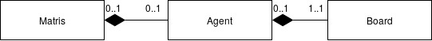

# MaTris

A clone of Tetris made using Pygame. Licensed under the GNU GPLv3. Works with both Python 2 and 3.

Run `python3 matris.py` to start the game

## Requires

Requires python 2.x or python 3.x

Requires pip: `sudo apt install python-pip` or `sudo apt install python3-pip`

Requires pygame: `sudo pip install pygame` or `sudo pip3 install pygame`

To run the artificial intelligence mode Keras is required. Installation information can be found [here](https://keras.io/).

## Changes from MaTris - Artificial Intelligence Extension
An artificial intelligence mode has been created. Running it in this mode runs the agent using a variation of a [Deep-Q-Network](https://storage.googleapis.com/deepmind-media/dqn/DQNNaturePaper.pdf) that uses an artificial neural network.

This mode is ran by default. To play this game manually, change the `agent_mode` variable in `matris.py` to false.

The logic of this mostly resides in `agent.py` although modifcations have been made to `matris.py` to allow for the agent to interact with the game.

## Usage
Command line arguments are required to run the agent:

`<mode> <episode_number> <filepath>`

The different modes are:
  * Random mode / `-ra <episode_number>`: Randomly placed tetrominos.
  * Column Differences:
    * Only / `-no <episode_number>`: Creates an agent that takes column differences as inputs only.
    * And holes / `-ho <episode_number>`: Creates an agent that takes column differences and holes as inputs.
    * And height / `-hi <episode_number>`: Creates an agent that takes column differences and height of the tallest column as inputs.
    * And holes and height: `hh <episode_number>`: Creates an agent that takes column differences, holes and height of the tallest column as inputs.
  * Load:
    * A previous created agent / `-lo <episode_number> <filepath>`: Loads an agent that has previously been trained in MaTris. Loads .obj file.
    * A agent created using MaTris-O-Handcraft program / `-lt <episode_number> <filepath>`: Loads an agent that has previously been trained using supervised learning in MaTris-O. Loads .obj file.

To run different versions of MaTris, i.e. versions with limited types of blocks, delete `tetrominoes.py` and replace it with a file in `tetrominos/` - such as `tetrominoes_O.py`  if you want to play a Tetris game with O blocks only - by moving that file up a directory. Rename the moved file to `tetrominoes.py`.

### agent.py
#### board
This class acts as a representation of the current Tetris board and stores various stats about the board. This class is given to the agent so that the agent can interpret the game state.

#### agent
This stores the current tetromino and a representation of the board. It then uses the information it has about the current game state to make a choice about where to place the current tetromino.

## Demo

## Coveted by academia
In 2013, my game [was used](http://eprints.ucm.es/22631/1/REMIRTA.pdf) by someone in Madrid to test "remote execution of multimedia interactive real-time applications". The next year, [a study in Denmark](https://www.academia.edu/6262472/Improving_game_experience_using_dynamic_difficulty_adjustment_based_on_physiological_signals) called "Improving game experience using dynamic difficulty adjustment" asked participants to "self-rate their valence and arousal [sic]" playing MaTris! Who would've thunk it? In 2016, people in Stanford [were using the game](http://cs231n.stanford.edu/reports/2016/pdfs/121_Report.pdf) to try out deep reinforcement learning, although apparently the result was not as "respectable" as it could've been. Not a problem in Korea, apparently, where students [are expected](http://nlp.chonbuk.ac.kr/AML/AML_assignment_2.pdf) to accomplish it! That stuff is way above my head, but perhaps my life will be spared during the singularity?

